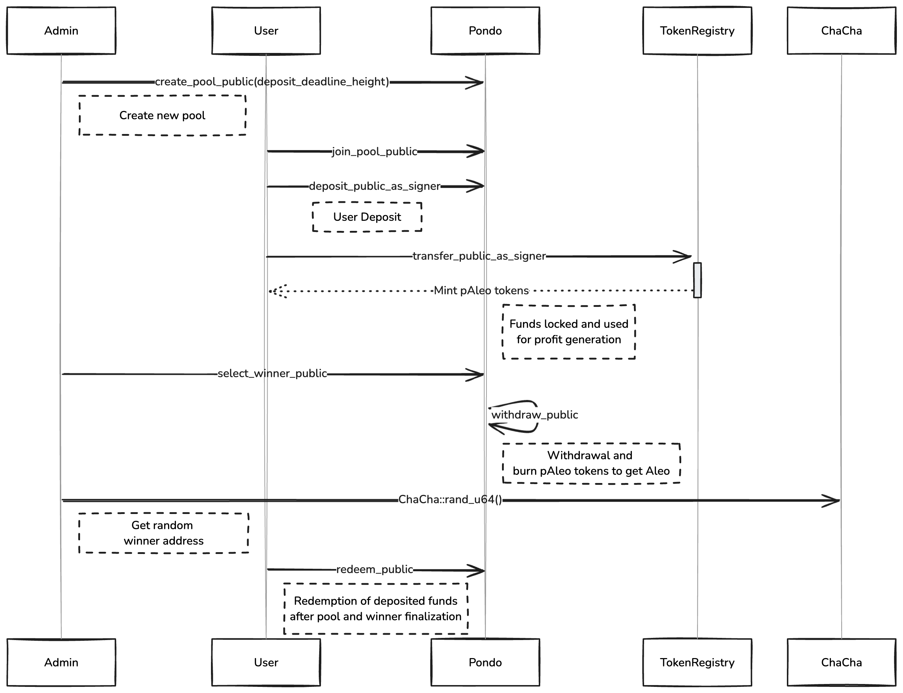

# Yokin Contract 

---

## Table of Contents

1. [Overview](#overview)
2. [Operational Flow](#recommended-operational-flow)
3. [Technical Flow of Funds](#technical-flow-of-funds)
4. [Contract Functions](#contract-functions)

---

## Overview

1. **Initialize** – `initialize`

    - Sets the initial admin (`init_admin`) and marks the contract as initialized.
    - Ensures that the contract cannot be re-initialized.

2. **Create Pool** – `create_pool_public`

    - Only the admin can create a new pool.
    - Accepts a `deposit_deadline_height` parameter (a block height) which determines until when deposits are allowed.
    - The pool ID is automatically generated by incrementing the total pool count.

3. **Join Pool** – `join_pool_public`

    - Users can deposit credits (Aleo) into an active pool.
    - Deposits are accepted only if the current block height is less than the pool’s `deposit_deadline_height`.
    - The function updates the pool’s total deposits, total pAleo minted, and records each user’s participation.

4. **Select Winner** – `select_winner_public`

    - Only the admin can call this function.
    - It requires that the deposit period is over (i.e. current block height > `deposit_deadline_height`) and that the pool has not yet been finalized (indicated by `redeem_block` being zero).
    - The function calls `withdraw_public` on the Pondo protocol to burn the pool’s pAleo, selects a winner at random using `ChaCha::rand_u64()`, and calculates the reward based on the withdrawal amount.
    - It sets the pool’s `redeem_block` to the claim block from the withdrawal, which marks when redemptions can begin.

5. **Redeem Deposits** – `redeem_public`

    - Allows a user to redeem their full deposit (plus any reward if they are the winner).
    - Redemption is only allowed once the current block height is at or past the pool’s `redeem_block`.
    - After redemption, the user’s deposit balance is reset to zero.

6. **Update Admin** – `update_admin_public`

    - Only the current admin can change the admin address.

7. **Total Pools** – `total_pool`
    - A getter function that returns the total number of pools created.

---

## Operational Flow

1. **Initialize the Contract**

    - Call `initialize(init_admin)` once to set the contract’s admin and mark it as initialized.

2. **Create a Pool**

    - The admin calls `create_pool_public(deposit_deadline_height)` with the desired block height deadline for deposits.
    - A new pool is created with an auto-incremented pool ID and begins accepting deposits.

3. **Users Join the Pool**

    - Users call `join_pool_public(pool_id, credits_deposit, expected_paleo_mint)` to deposit funds into the pool.
    - Deposits are accepted only if the current block height is less than the pool’s `deposit_deadline_height`.

4. **Finalize the Pool & Select a Winner**

    - Once the deposit period has ended (i.e. `block.height` > `deposit_deadline_height`), the admin calls `select_winner_public(pool_id, paleo_burn_amount)`.
    - This call withdraws (and burns) the pool’s pAleo, randomly selects a winner, calculates any reward, and sets the pool’s `redeem_block` based on the withdrawal claim block.

5. **Users Redeem Their Deposits**

    - After the `redeem_block` has been reached (i.e. `block.height` >= `redeem_block`), users call `redeem_public(pool_id, player, credits_redeem)` to withdraw their deposits (plus any reward for the winner).

6. **Update Admin (Optional)**

    - The current admin may update the admin address by calling `update_admin_public(new_admin)`.

7. **Query Total Pools**
    - Anyone can call the `total_pool` getter to find out how many pools have been created.

---

## Technical Flow of Funds

This document outlines the technical flow of funds within the Yokin contract, detailing how Aleo credits and pAleo tokens move through the system—from the initial deposit, through profit generation, to winner selection and eventual redemption.

### 1. Pool Creation

-   **Function:** `create_pool_public`
-   **Process:**
    -   The admin creates a new pool by providing a `deposit_deadline_height` (a block height) which defines the last block at which deposits can be made.
    -   A unique pool ID is automatically generated by incrementing the total pool counter.
    -   The new pool is stored in the contract’s state with all counters (total deposits, total pAleo, and total players) set to zero.
-   **Outcome:**  
    The pool is now live and ready to accept deposits until the specified block height.

### 2. Depositing Funds

-   **Function:** `join_pool_public`
-   **Process:**
    -   **Credit Deposit:**  
        Users deposit Aleo credits into a specified pool. This is done via an inter-contract call to the Pondo protocol's `deposit_public_as_signer` function.
    -   **pAleo Minting:**  
        Simultaneously, the token registry is called via `transfer_public_as_signer` to mint pAleo tokens corresponding to the deposited credits.
    -   **State Update:**  
        The contract records the deposit by updating:
        -   The user's balance (using a hashed key based on their address and the pool ID).
        -   The pool’s aggregate counters: total deposits, total pAleo, and total number of participants.
-   **Condition:**  
    Deposits are only accepted if the current block height is less than the pool's `deposit_deadline_height`.

### 3. Funds Locking and Profit Generation

-   **Process:**
    -   Once the block height surpasses the `deposit_deadline_height`, no further deposits are allowed.
    -   The funds deposited into the pool become locked.
    -   During the locked phase, the deposited funds may be utilized by the Pondo protocol to generate profits.
-   **Outcome:**  
    The pool transitions from the deposit phase to a profit generation phase where the funds are actively managed to accrue profit.

### 4. Winner Selection and Withdrawal

-   **Function:** `select_winner_public`
-   **Process:**
    -   **Withdrawal Call:**  
        After the deposit period ends (i.e. when `block.height` is greater than `deposit_deadline_height`), the admin triggers the function, which calls `withdraw_public` on the Pondo protocol. This call:
        -   Withdraws the accumulated pAleo.
        -   Burns the pAleo tokens, ensuring they are removed from circulation.
    -   **Random Winner Selection:**  
        A pseudo-random number is generated using `ChaCha::rand_u64()`, and a winner is selected based on the total number of players in the pool.
    -   **Reward Calculation:**  
        The withdrawn funds (microcredits) are compared with the total deposited amount to compute a reward.
    -   **State Update:**  
        The pool’s state is updated with the calculated reward and the `redeem_block` is set, marking the earliest block height at which funds can be redeemed.
-   **Condition:**  
    This function is only callable if:
    -   The current block height is greater than `deposit_deadline_height`.
    -   The pool has not yet been finalized (i.e., `redeem_block` is still zero).

### 5. Redemption of Deposited Funds

-   **Function:** `redeem_public`
-   **Process:**
    -   **Eligibility Check:**  
        Redemption is permitted only once the current block height is equal to or greater than the pool’s `redeem_block`.
    -   **Withdrawal:**  
        The function retrieves the recorded deposit for each user:
        -   If the user is the selected winner, they receive their full deposit plus the calculated reward.
        -   Otherwise, the user receives only their original deposit.
    -   **Post-Redemption:**  
        After successful redemption, the user's balance for that pool is reset to zero to prevent multiple claims.
-   **Outcome:**  
    Funds are securely returned to the rightful participants after the pool is finalized and the redemption window opens.

---

## Contract Functions

### Initialize Contract

**Function:** `initialize`

| Argument     | Type      | Description                   |
| ------------ | --------- | ----------------------------- |
| `init_admin` | `address` | Initial admin of the contract |

-   **Remarks:** Can only be called once; sets the initialized flag.

---

### Create Pool

**Function:** `create_pool_public`

| Argument                  | Type  | Description                                               |
| ------------------------- | ----- | --------------------------------------------------------- |
| `deposit_deadline_height` | `u32` | Block height after which no new deposits will be accepted |

-   **Remarks:**
    -   Only the admin can create a pool.
    -   The pool ID is automatically incremented based on the current total pool count.

---

### Join Pool

**Function:** `join_pool_public`

| Argument              | Type  | Description                                                   |
| --------------------- | ----- | ------------------------------------------------------------- |
| `pool_id`             | `u64` | ID of the pool to join                                        |
| `credits_deposit`     | `u64` | Amount of Aleo to deposit                                     |
| `expected_paleo_mint` | `u64` | Expected amount of pAleo to be minted (as provided by the UI) |

-   **Remarks:**
    -   Deposits are accepted only if the current block height is less than `deposit_deadline_height`.
    -   Player participation is recorded and their balance is updated accordingly.

---

### Select Winner

**Function:** `select_winner_public`

| Argument            | Type  | Description                                                                         |
| ------------------- | ----- | ----------------------------------------------------------------------------------- |
| `pool_id`           | `u64` | ID of the pool to finalize and from which the winner is selected                    |
| `paleo_burn_amount` | `u64` | Total pAleo amount in the pool (must match the stored total pAleo for verification) |

-   **Remarks:**
    -   Only the admin can call this function once the deposit period is over (i.e. `block.height` > `deposit_deadline_height` and before redemption).
    -   This function burns the pool’s pAleo, selects a winner at random, calculates the reward, and sets the pool’s `redeem_block` based on the withdrawal claim block.

---

### Redeem Deposits

**Function:** `redeem_public`

| Argument         | Type      | Description                                                                                           |
| ---------------- | --------- | ----------------------------------------------------------------------------------------------------- |
| `pool_id`        | `u64`     | ID of the pool                                                                                        |
| `player`         | `address` | Address of the player redeeming their deposit                                                         |
| `credits_redeem` | `u64`     | The expected redeemed amount (equal to the deposited amount, plus reward if the player is the winner) |

-   **Remarks:**
    -   Redemption is allowed only when `redeem_block` is set and the current block height is at or past `redeem_block`.
    -   After a successful redemption, the player’s balance is reset to zero.

---

### Update Admin

**Function:** `update_admin_public`

| Argument    | Type      | Description              |
| ----------- | --------- | ------------------------ |
| `new_admin` | `address` | Address of the new admin |

-   **Remarks:**
    -   Only the current admin can update the admin address.

---
